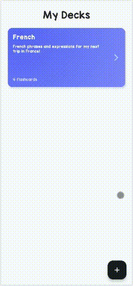
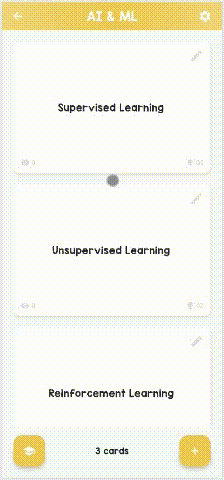

# Jokerly 🃏
\~*_Become jokerly good at anything with flashcards!_*\~

**Jokerly** is _yet_ another flashcard application that help you **learn and memorize** anything you want. The application is developed with Flutter for the web platform, thus letting you use it "au bureau"🧑‍💻 and on the go📱!

## Summary 📑
- [Features](#features-)
- [Getting Started](#getting-started-)
    - [Prerequisites](#prerequisites-)
    - [Running the Application](#running-the-application-)
- [Screenshots](#screenshots-️)

## Features 📦
- Create and manage textual flashcards with questions and answers.
- **🔨WIP**: Review flashcards using spaced repetition algorithms.
- **🙊MORE TO COME...**

## Getting Started 📤
### Prerequisites 🔰
- Docker installed (https://www.docker.com/)
- Docker Compose installed (https://docs.docker.com/compose/install/)

### Running the Application 🏃💨
1. Clone this repository: ```git clone https://github.com/nathan68560/Jokerly.git```.
2. Navigate to the project directory: ```cd Jokerly```.
3. Build and run the Docker container: ```docker-compose up -d```.
4. Access the application: [localhost:8080](http://localhost:8080).


## Screenshots 📸
| Deck creation | Flashcard creation/edition | Deck review lesson |
|:-:|:-:|:-:|
||||